```{r setup, include=FALSE}
knitr::opts_chunk$set(echo = FALSE)
```

## The big outline

* Part 0: Background
* Part 1: A bit about R
* Part 2: RStudio & Project setup
* Part 3: R, RMarkdown, & more
* Part 4: Advanced, beyond, & our favorites

# Part 0: Background

## To dive right in

If you want to skip over the background & RStudio, go straight to [Part 2: RStudio & Project setup]

## Background

* This is a taste and to bring you into a bigger world
  * R, Python, SQL, and JavaScript are critical data science tools/languages
* R (language and community) strongly emphasizes 
  * Centralization & standards
  * Rigor & reproducibility (packages, RMarkdown)
* An interesting language
  * Functional
  * With a sublanguage (or dialect?): the `tidyverse`


## R is a community (actually many communities!)

* Help and resources
* Package development and distribution
* An ideal example
  * Not quite always that way
  * Strong communal presence

## R: Help!

* So many websites e.g., https://www.statmethods.net/
* Online forums (Stack Exchange, r-lists)
* SpringerLink
  * All R books for free (pdf format) or for minimal cost (printed)
* Vignettes
  * step-by-step instruction guides for packages
* Git
  * With open books (via bookdown)
* Twitter #rstats
* RStudio (website)
  * Videos, cheat sheets

## R Packages

* Packages are bundles of code made by someone (or many people) for everyone to use
  * There are packages for everything
  * We'll cover some of the diversity throughout
* Comprehensive & Reproducible
* Available primarily on CRAN
  * But also github (less so: r-forge)
  
# Part 1: A bit about R

## R Background

* Created in 1992 by Gentleman & Ihaka

 _[we] considered the problem of obtaining decent statistical software for our undergraduate Macintosh lab. After considering the options, we decided that the most satisfactory alternative was to write our own. […] Finally we added some syntactic sugar to make it look somewhat like S. We call the result “R”._


## What is R?

* R is general purpose programming
  * Design around & for statistics
  * "for and by statisticians"
* R is a collection of tools 
  * Pre-packaged software at your disposal
* R is free (as in beer and speech)
  * No cost, no restrictions
  * E.g., Microsoft (nee Revolution) R
* R is a functional language
  * Turing complete
  * Mathematical functions
  * Pass expressions and functions to and from functions

## R: Data types

* Stored as *vectors*
  * see `class()`
* numeric
  * real or decimal
  * Includes `NaN`, `Inf`, `-Inf`
* integer
* complex
* character
* logical
  * includes `NA`, `TRUE`, `FALSE`
* factor
  * factors are usually not your friends
  * generally: stringsAsFactors = F or convert these

## R: factor disasters

```{r factors_are_not_friendly, echo=T}

a_numeric_vector <- c(3, 0, 1, -2, 2, 5, 5, 2, 1)
(a_numeric_vector + 1)
(a_numeric2factor_vector <- as.factor(a_numeric_vector))
(as.numeric(a_numeric2factor_vector))
(as.numeric(as.character(a_numeric2factor_vector)))

```

## R: Data structures  

* Starts counting from 1
  * Not 0
* vector[1]
* matrix[1,1]
* array[1,1,1]
* list[[1]]
  * Can contain mixtures of types
  * or list$`name`
* data.frame:
  * Is technically a list but access in three ways
  * data.frame[[1]][1]
  * data.frame[1,1]
  * data.frame$`name`
  * tibbles: tidyverse data.frames
    
## R

Some more about R here...
Matlab cheat sheet
Other cheat sheets
    
## Tidyverse
* something here about tidy
* Learn it. But don’t learn *only* the tidyverse; you’ll be lost in base R

# Part 2: RStudio & Project setup

## RStudio

* IDE: Integrated development environment
* RStudio: Does so much
  * We scratch the surface here
* Quick walk through
* Followed by specific set up 
  * Generally, but
  * Also for this workshop
  
## RStudio Setup

* Download R and Rstudio
* Strongly recommend Microsoft R (https://mran.microsoft.com/open)
  * Comes with Intel MKL
* Plain R is fine (https://cran.r-project.org/)
    * Can relink to faster libraries 
* Download RStudio (https://www.rstudio.com/)  

## RStudio Environment


## RStudio Environment


## RStudio Environment 


## RStudio Environment 


## RStudio Environment 


## RStudio Environment 


## Some benefits of RStudio

* Built-in integration with version control (git or SVN)
* Package and documentation generation
* Reproducible science!
  * R Markdown documents
    * Save and execute code
    * Generate high quality reports that can be shared
  * Create presentations (like this one!)
  * Even write papers
  * Python, D3 (JavaScript), SQL, Shiny, LaTeX, Git/SVN, HTML/CSS, and so much more.
* This workshop
  * Will walk you through some of this (and more)
  * See https://github.com/jennyrieck/workshops/tree/master/2019_Rstudio_Magic

## RStudio is more

* Not just an IDE
* A company
* A community
* A conference
* A centralized resource


## RStudio Resources


## RStudio Resources


## RStudio Resources


## Project and Environment Setup

* Special & hidden files
* Having a structure


## RStudio Setup

* See https://jennybc.github.io/2014-05-12-ubc/r-setup.html for a detailed guide

## For safety & collaboration 

* Project(s) files
  * SOMETHING!
  
## Projects through Git

* Create a new project File
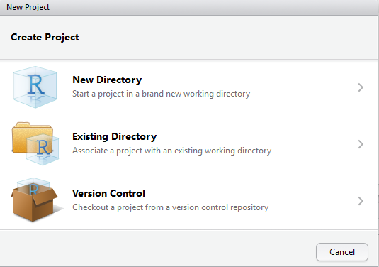{width=75%} 


## Git & Projects

* Git
  * Download git and link executable within RStudio 
  {width=60%} 

## Format .gitignore

* File types to ignore via version control
  * `**` before each extentions will match directories anywhere in the repo
  
  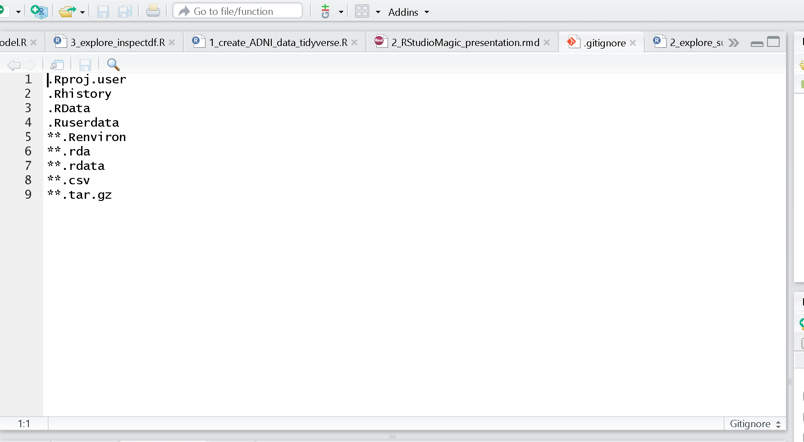{width=75%}
    
## Environmental variables

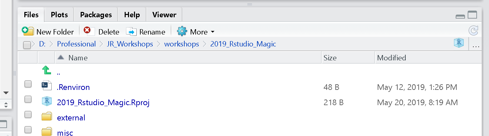{width=60%}

## Format environmental variables

* Set environmental variables (ie, directory location of data) to make code generalizable across computers
  * Don't commit or share these
* In **your** project folder create a `.Renviron` file and define variables
  * Jenny's:
  
  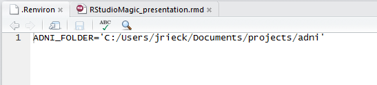{width=60%}
  
  * Derek's:
  
  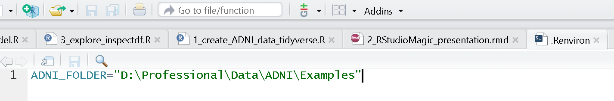{width=80%}

## Organize your project folders and markdown

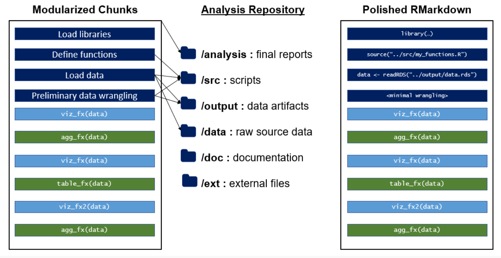

https://emilyriederer.netlify.com/post/rmarkdown-driven-development/


## Organize your project folders and markdown

* What works for you?
* What works for your organization or team?
* Maximize utility, minimize complexity

## This works for us

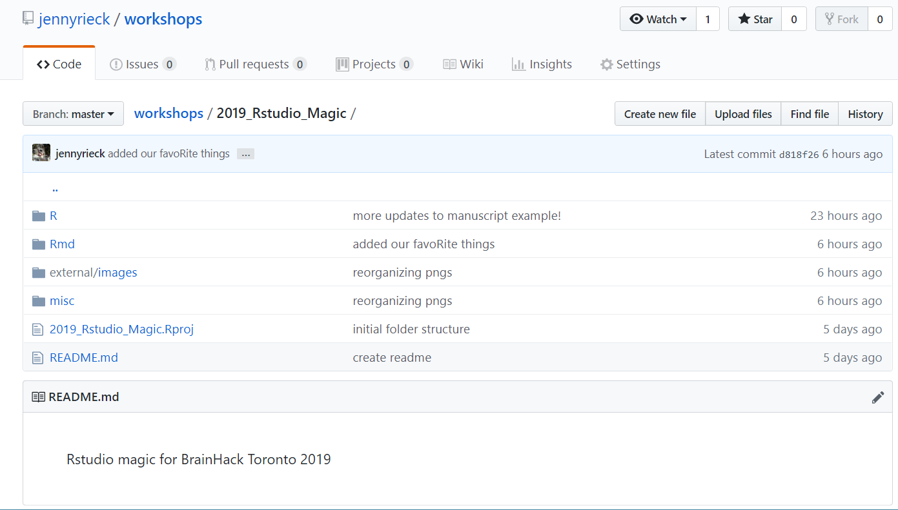

## This works for us

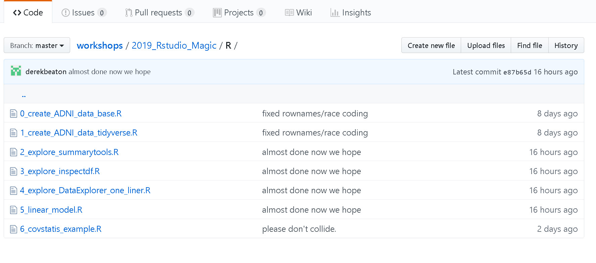

## This works for us


## Get the packages you need

```{r install_packages, echo=T, eval=F}
#to install from CRAN
install.pacakges('devtools', depenedencies = TRUE)

#to install from a git  (requires the devtools package)
dev.tools::install_github(Gibbsdavidl/CatterPlots)

#to install from a file
install.packages('/mypath/to/package/ADNIMERGE.tar.gz', 
                 type='source', repos=NULL) 
```

## Some transition?


## R et al

Here we dive into our stuff.
We show a bit of the code here and there and explain syntax
		
## Read in and create your dataframe

* ADNI Dataset adnimerge package
    * Reduce full dataset to only those participants (rows) and variables (columns) you're interested in
* Two methods to create your dataframe
    * using base R functions: `0_create_ADNI_data_base.R`
    * Using tidyverse functions: `1_create_ADNI_data_tidyverse.R`

## Screenshots

Explanation
    
## Exploring your data

* Many packages to help explore and describe your data:
    * summarytools: `2_explore_summarytools.R`
    * inspectdf: `3_explore_inspectdf.R`
    * DataExplorer: `4_explore_DataExplorer_one_liner.R`

## Code w/ eval=F
    
## Hard Break

* DataExplorer is dangerous
* Blind analyses can be *criminal*
  * de Leeuw paper quote
  * DEREK RANTS, PER USUAL.
  

## Analyze you data

* Linear models: `5_linear_model.R`

## Screenshots / Code w/ eval=F

## Get experimental

* Explain motivation, not method
* covSTATIS: `6_covstatis_example.R`

# Part 3: RMarkdown

## RMarkdown

* What it is /why to use it
* A short deviation for LaTeX, and new helpers: kable & kableExtra
	* A taxonomy and how to approach this
	*Tying it all together through here
		1: simple RMD
*Plot-based visuals
		* Base, gt, ggplot, grobTable()/grid/gridExtra
		* 2: Slides (these ones here)
		* 3: Manuscripts!!
* Reporting/presentin

## RMarkdown Don(u)'ts

* Don't hardcode values
* Don't hardcode absolute file paths
* Don't do complicated database queries
* Don't litter
    * avoid `eval=FALSE`
    * reduce repeated code by making functions
* Don't load unneccesary libraries
* More at: https://emilyriederer.netlify.com/post/rmarkdown-driven-development/

# Part 4: Advanced R

## Some advanced/other things we’re not covering
* package development
* Shiny
* SQL
* C/C++
* R2D3


## A few of our favorite things

* Fun R do-dads


## CatterPlot for feline based graphics:

* https://github.com/Gibbsdavidl/CatterPlots

`dev.tools::install_github(Gibbsdavidl/CatterPlots)`

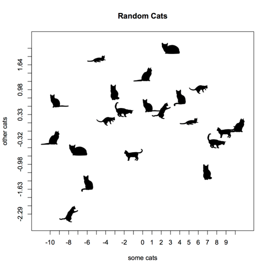{width=60%}

## What's a pirate's favorite programming language?

* https://cran.r-project.org/web/packages/yarrr/vignettes/pirateplot.html

`install.packages('yarrr')`

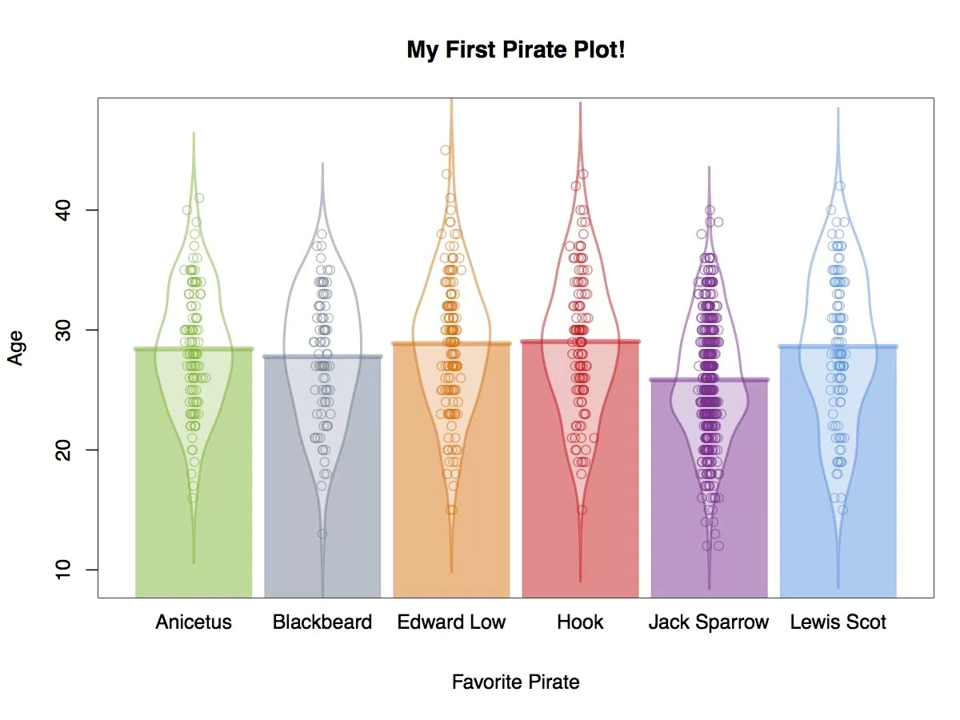{width=75%}

## Color palettes to fit your ~mood~

* https://github.com/karthik/wesanderson

`dev.tools::install_github(karthik/wesanderson)`

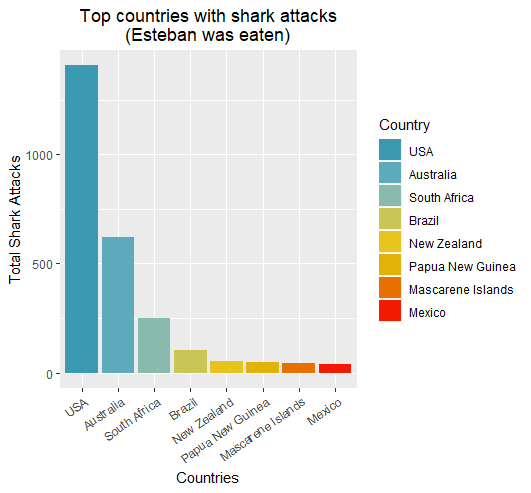

## Mapping your Strava routes

* https://www.r-bloggers.com/strava-rides-map-in-r/
* ALSO https://marcusvolz.com/?p=4068
    * `dev.tools::install_github(marcusvolz/strava)`
    
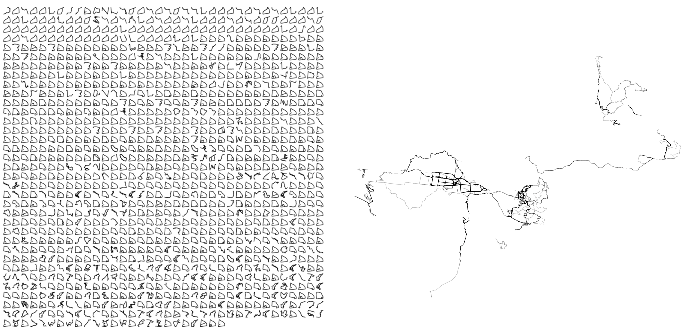

## Make aRt!

* R Graph Gallery
    * http://www.r-graph-gallery.com/
* Rtist: Gaston Sanchez
    * http://gastonsanchez.com/Rtist/
    
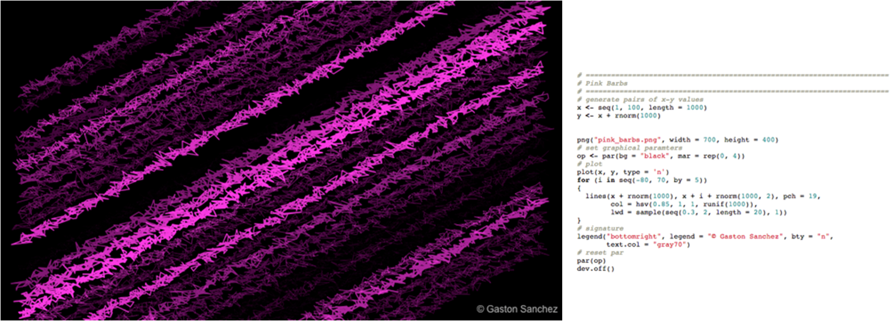

