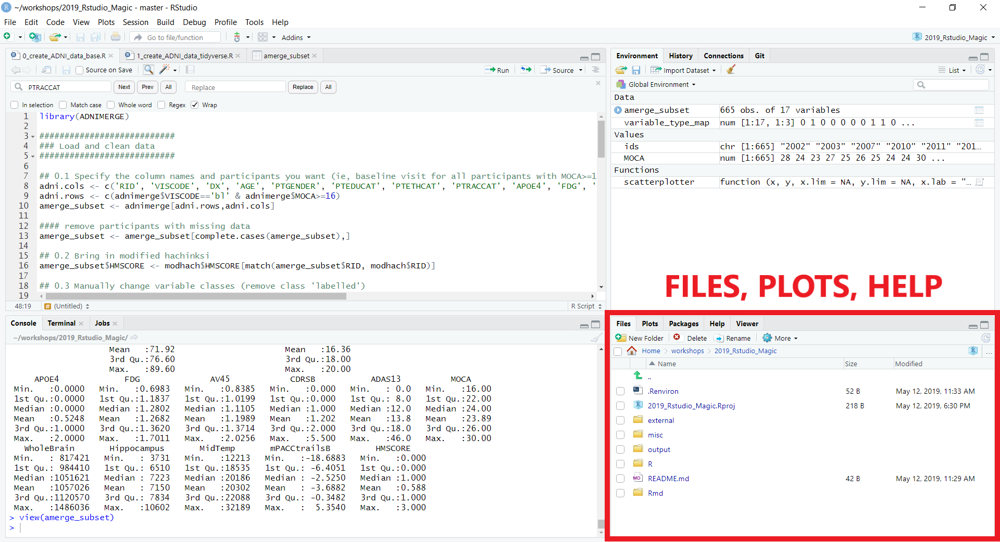
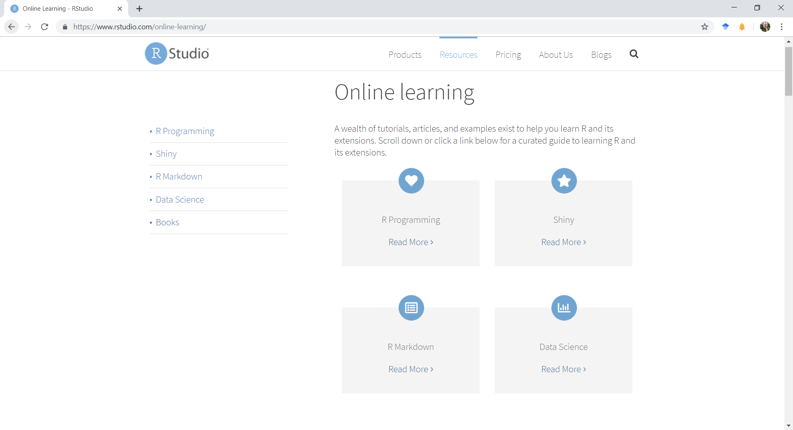

```{r setup, include=FALSE}
knitr::opts_chunk$set(echo = FALSE)
```

## The big outline

* Part 0: Introduction, background, & RStudio
* Part 1: Setup & R
* Part 2: RMarkdown & more
* Part 3: Advanced, beyond, & our favorites

# Part 0: Introduction, Background, & RStudio

## To dive right in

If you want to skip over the background & RStudio, go straight to [Part 1: Setup & R]

## Background

* This is a taste and to bring you into a bigger world
  * R, Python, SQL, and JavaScript are critical data science tools/languages
* R (language and community) strongly emphasizes 
  * Centralization & standards
  * Rigor & reproducibility (packages, RMarkdown)
* An interesting language
  * Functional
  * With a sublanguage (or dialect?): the `tidyverse`


## R is a community (actually many communities!)

* Help and resources
* Package development and distribution
* An ideal example
  * Not quite always that way
  * Strong communal presence

## R: Help!

* So many websites e.g., https://www.statmethods.net/
* Online forums (Stack Exchange, r-lists)
* SpringerLink
  * All R books for free (pdf format) or for minimal cost (printed)
* Vignettes
  * step-by-step instruction guides for packages
* Git
  * With open books (via bookdown)
* Twitter #rstats
* RStudio (website)
  * Videos, cheat sheets

## R Packages

* Packages are bundles of code made by someone (or many people) for everyone to use
  * There are packages for everything
  * We'll cover some of the diversity throughout
* Comprehensive & Reproducible
* Available primarily on CRAN
  * But also github (less so: r-forge)

## RStudio

* IDE: Integrated development environment
* RStudio: Does so much
  * We scratch the surface here
* Quick walk through
* Followed by specific set up 
  * Generally, but
  * Also for this workshop

## RStudio Environment


## RStudio Environment


## RStudio Environment 


## RStudio Environment 


## RStudio Environment 


## RStudio Environment 


## Some benefits of RStudio

* Built-in integration with version control (git or SVN)
* Package and documentation generation
* Reproducible science!
  * R Markdown documents
    * Save and execute code
    * Generate high quality reports that can be shared
  * Create presentations (like this one!)
  * Even write papers
  * Python, D3 (JavaScript), SQL, Shiny, LaTeX, Git/SVN, HTML/CSS, and so much more.
* This workshop
  * Will walk you through some of this (and more)
  * See https://github.com/jennyrieck/workshops/tree/master/2019_Rstudio_Magic

## RStudio is more

* Not just an IDE
* A company
* A community
* A conference
* A centralized resource


## RStudio Resources


## RStudio Resources


## RStudio Resources


# Part 1: Setup & R

## Project and Environment Setup

Somethign...?

## Project and Environment Setup

* Hidden files & whatnot
* Have a structure ready to go on Github
* Explain/walk through
* Discuss the helpful packages above


## RStudio Setup

* See https://jennybc.github.io/2014-05-12-ubc/r-setup.html for a detailed guide

## For safety & collaboration 

* Projects
  * SOMETHING?
  
## Git & Projects

* Git
  * Download git and link executable within RStudio 
  {width=60%} 

## Projects through Git

* Create a new project File
{width=75%} 

## Format .gitignore

* File types to ignore via version control
  * `**` before each extentions will match directories anywhere in the repo
  
  {width=75%} 
    
## Format environmental variables

* Set environmental variables (ie, directory location of data) to make code generalizable across computers
  * Don't commit or share these
* In **your** project folder create a `.Renviron` file and define variables
  * Jenny's:
  
  {width=60%}
  
  * Derek's:
  
  {width=80%}

## Organize your project folders and markdown

*https://emilyriederer.netlify.com/post/rmarkdown-driven-development/


## Organize your project folders and markdown

!!PICK UP HERE!!


## Organize your project folders and markdown

SHOW R


## Organize your project folders and markdown


SHOW RMD


## RStudio Setup

* Download R and Rstudio
* Add-on packages

```{r install_packages, echo=T, eval=F}
#to install from CRAN
install.pacakges('devtools', depenedencies = TRUE)
#to install from a file
install.packages('/mypath/to/package/ADNIMERGE.tar.gz', 
                 type='source', repos=NULL) 
#to install from a git  (requires the devtools package)
dev.tools::install_github(Gibbsdavidl/CatterPlots) 
```

## R Background

* Created in 1992 by Gentleman & Ihaka

 _[we] considered the problem of obtaining decent statistical software for our undergraduate Macintosh lab. After considering the options, we decided that the most satisfactory alternative was to write our own. […] Finally we added some syntactic sugar to make it look somewhat like S. We call the result “R”._


## What is R?

* R is for stats and general purpose programming
* R is a functional language
    * Turing complete -- can do anything other languages can do
* R is an environment to inferface with the langauge
    * Console based
    * Type in commands
    * No point-and-click
* R is a collection of tools 
    * Pre-packaged software at your disposal
* R is free (as in beer and speech)
    * No cost, no restrictions
    
## A little bit more about beer

* R is free (as in beer and speech)
    * No cost, no restrictions
    * Revolution/MRAN
    * etc...

## R et al
* A bit of background, including idiosyncrasies and unique things about R
    * Especially packages & three ways to install (somewhat covered above)
			CRAN, Locally,  Git & others (devtools)
    * It’s a functional language
    * Data types Including data frames & alts like tibbles
    
## R

Some more about R here...
    
## Tidyverse
* something here about tidy
* Learn it. But don’t learn *only* the tidyverse; you’ll be lost in base R

## R et al
* A bit of background, including idiosyncrasies and unique things about R
    * Especially packages & three ways to install (somewhat covered above)
			CRAN, Locally,  Git & others (devtools)
    * It’s a functional language
    * Data types Including data frames & alts like tibbles
* Read/explore
    * explore .R scripts
* Clean/export
    * Show 0_Create from PCA/MCA with
			Base, Tidyverse, Plyr (NOT dplyr), data.table
	* Reimport?
	* Analyze
		With MCA & covstatis
		
## Read in and create your dataframe

* ADNI Dataset adnimerge package
    * Reduce full dataset to only those participants (rows) and variables (columns) you're interested in
* Two methods to create your dataframe
    * using base R functions: `0_create_ADNI_data_base.R`
    * Using tidyverse functions: `1_create_ADNI_data_tidyverse.R`

## Screenshots

Explanation
    
## Exploring your data

* Many packages to help explore and describe your data:
    * summarytools: `2_explore_summarytools.R`
    * inspectdf: `3_explore_inspectdf.R`
    * DataExplorer: `4_explore_DataExplorer_one_liner.R`

## Code w/ eval=F
    
## Hard Break

* DataExplorer is dangerous
* Blind analyses can be *criminal*
  * de Leeuw paper quote
  * DEREK RANTS, PER USUAL.
  

## Analyze you data

* Linear models: `5_linear_model.R`

## Screenshots / Code w/ eval=F

## Get experimental

* Explain motivation, not method
* covSTATIS: `6_covstatis_example.R`

# Part 2: RMarkdown

## RMarkdown

* What it is /why to use it
* A short deviation for LaTeX, and new helpers: kable & kableExtra
	* A taxonomy and how to approach this
	*Tying it all together through here
		1: simple RMD
*Plot-based visuals
		* Base, gt, ggplot, grobTable()/grid/gridExtra
		* 2: Slides (these ones here)
		* 3: Manuscripts!!
* Reporting/presentin

## RMarkdown Don(u)'ts

* Don't hardcode values
* Don't hardcode absolute file paths
* Don't do complicated database queries
* Don't litter
    * avoid `eval=FALSE`
    * reduce repeated code by making functions
* Don't load unneccesary libraries
* More at: https://emilyriederer.netlify.com/post/rmarkdown-driven-development/

# Part 3: Advanced R

## Some advanced/other things we’re not covering
* package development
* Shiny
* SQL
* C/C++
* R2D3


## A few of our favorite things

* Fun R do-dads


## CatterPlot for feline based graphics:

* https://github.com/Gibbsdavidl/CatterPlots

`dev.tools::install_github(Gibbsdavidl/CatterPlots)`

{width=60%}

## What's a pirate's favorite programming language?

* https://cran.r-project.org/web/packages/yarrr/vignettes/pirateplot.html

`install.packages('yarrr')`

{width=75%}

## Color palettes to fit your ~mood~

* https://github.com/karthik/wesanderson

`dev.tools::install_github(karthik/wesanderson)`


## Mapping your Strava routes

* https://www.r-bloggers.com/strava-rides-map-in-r/
* ALSO https://marcusvolz.com/?p=4068
    * `dev.tools::install_github(marcusvolz/strava)`
    


## Make aRt!

* R Graph Gallery
    * http://www.r-graph-gallery.com/
* Rtist: Gaston Sanchez
    * http://gastonsanchez.com/Rtist/
    


