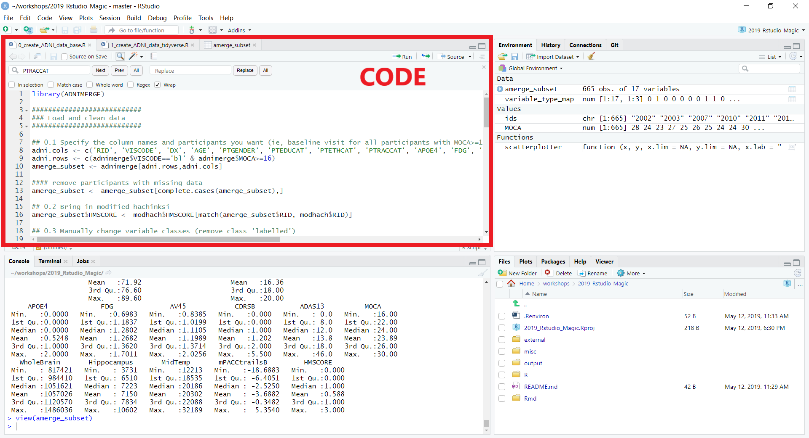
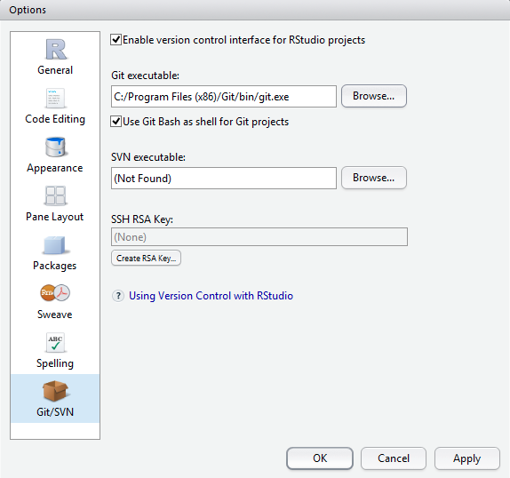
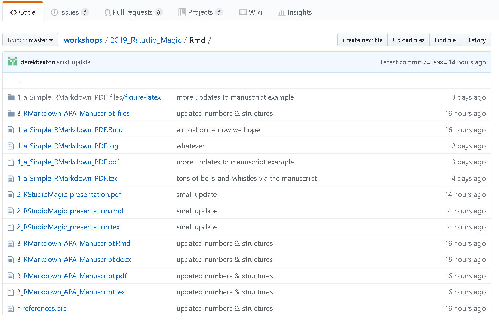

```{r setup, include=FALSE}
knitr::opts_chunk$set(echo = FALSE)
```

## The big outline

* Part 0: Background
* Part 1: A bit about R
* Part 2: RStudio & Project setup
* Part 3: R
* Part 4: RMarkdown & more
* Part 5: "Advanced" topics

# Part 0: Background

## To dive right in

If you want to skip over the background & RStudio, go straight to [Part 2: RStudio & Project setup]

## Background

* This is a taste and to bring you into a bigger world
  * R, Python, SQL, and JavaScript are critical data science tools/languages
* R (language and community) strongly emphasizes 
  * Centralization & standards
  * Rigor & reproducibility (packages, RMarkdown)
  * An interesting language
* Functional
  * With a sublanguage (or dialect?): the `tidyverse`


## R is a community (actually many communities!)

* Help and resources
* Package development and distribution
* An ideal example
  * Not quite always that way
  * Strong communal presence

## R: Help!

* So many websites e.g., https://www.statmethods.net/
* Online forums (Stack Exchange, r-lists)
* SpringerLink
  * All R books for free (pdf format) or for minimal cost (printed)
* Vignettes
  * step-by-step instruction guides for packages
* Git
  * With open books (via bookdown)
* Twitter #rstats
* RStudio (website)
  * Videos, cheat sheets

## R Packages

* Packages are bundles of code made by someone (or many people) for everyone to use
* There are packages for everything
* We'll cover some of the diversity throughout
* Comprehensive & Reproducible
  * Available primarily on CRAN
  * But also github (less so: r-forge)

# Part 1: A bit about R

## R Background

* Created in 1992 by Gentleman & Ihaka

_[we] considered the problem of obtaining decent statistical software for our undergraduate Macintosh lab. After considering the options, we decided that the most satisfactory alternative was to write our own. […] Finally we added some syntactic sugar to make it look somewhat like S. We call the result “R”._


## What is R?

* R is general purpose programming
  * Design around & for statistics
  * "for and by statisticians"
* R is a collection of tools 
  * Pre-packaged software at your disposal
* R is free (as in beer and speech)
  * No cost, no restrictions
  * E.g., Microsoft (nee Revolution) R
* R is a functional language
  * Turing complete
  * Mathematical functions
  * Pass expressions and functions to and from functions

## Some syntax notes

## Assignment

```{r assigment, eval=FALSE, echo=TRUE, tidy=FALSE}
# allowed but not preferred
a_variable = 10 + 1
# preferred
a_variable <- 10 + 1
# a bonus
10 + 1 -> a_variable
```

## Dots

```{r dots_example, eval=FALSE, echo=TRUE}
# allowed but not preferred
a.variable = 10 + 1
  ## dots have 2 meanings in R, 
    ## with a 3rd in the tidyverse

# preferred
a_variable <- 10 + 1
```

## "Reserved" characters

* `c`, `q`, `t`, `C`, `D`, `I`, `F`, and `T` (via https://www.johndcook.com/blog/r_language_for_programmers/)
* Except that these can be redefined
  * With great power comes great responsibility (and danger)


## R: Data types

* Stored as *vectors*
  * see `class()`
* numeric
  * real or decimal
  * Includes `NaN`, `Inf`, `-Inf`
* integer
* complex
* character
* logical
  * includes `NA`, `TRUE`, `FALSE`
* factor
  * factors are usually not your friends
  * with `read.csv()`: `stringsAsFactors = F` or convert these
  * or use `tibble`s in the tidyverse

## R: factor disasters

```{r factors_are_not_friendly, echo=T}
a_numeric_vector <- c(3, 0, 1, -2, 2, 5, 5, 2, 1)
(a_numeric_vector + 1)
(a_numeric2factor_vector <- as.factor(a_numeric_vector))
(as.numeric(a_numeric2factor_vector))
(as.numeric(as.character(a_numeric2factor_vector)))
```

## R: Data structures  

* Starts counting from 1
  * Not 0
* vector[1]
* matrix[1,1]
* array[1,1,1]
* list[[1]]
  * Can contain mixtures of types
  * or list$`name`
* data.frame:
  * Is technically a list but access in three ways
  * data.frame[[1]][1]
  * data.frame[1,1]
  * data.frame$`name`
  * tibbles: tidyverse data.frames

## Cheatsheet for going from MatLab to R


http://mathesaurus.sourceforge.net/octave-r.html

## Cheatsheet for base R


## Tidyverse

* R is "base R"
* `tidyverse`: "an opinionated collection of R packages designed for data science [that] share an underlying design philosophy, **grammar, and data structures.**"
  * Started(?) with/because of `ggplot2`
  * A sublanguage or dialect
  * Can do so because R is functional language
  * For full tidy immersion see: https://style.tidyverse.org/
* Strongly built around a style:
  * objects are nouns
  * functions are verbs
* Core packages:
  * `ggplot2`, `dplyr`, `tidyr`, `readr`, `tibble`, `stringr`
* Get them all with `install.packages("tidyverse")`
* Learn it! 
  * But don’t learn *only* the tidyverse, you’ll be lost in base R

## tidyverse cheatsheet


# Part 2: RStudio & Project setup

## RStudio

* IDE: Integrated development environment
* RStudio: Does so much
  * We scratch the surface here
* Quick walk through
  * Followed by specific set up 
  * Generally, but
  * Also for this workshop

## RStudio Setup

* Download R and Rstudio
  * Strongly recommend Microsoft R (https://mran.microsoft.com/open)
  * Comes with Intel MKL
* Plain R is fine (https://cran.r-project.org/)
  * Can relink to faster libraries 
* Download RStudio (https://www.rstudio.com/)  

## RStudio Environment


## RStudio Environment


## RStudio Environment 


## RStudio Environment 


## RStudio Environment 


## RStudio Environment 


## Some benefits of RStudio

* Built-in integration with version control (git or SVN)
* R Markdown
  * Save and execute code
  * Generate high quality reports that can be shared
  * Create presentations (like this one!)
  * Even write papers
  * This workshop
    * See https://github.com/jennyrieck/workshops/tree/master/2019_Rstudio_Magic
* Python, D3 (JavaScript), SQL, Shiny, LaTeX, Git/SVN, HTML/CSS, and so much more.


## RStudio is more

* Not just an IDE (integrated development environment)
* A company
* A community
* A conference
* A centralized resource


## RStudio Resources


## RStudio Resources


## RStudio Resources


## Project and Environment Setup

* Special & hidden files
* Having a structure


## RStudio Setup

* See https://jennybc.github.io/2014-05-12-ubc/r-setup.html for a detailed guide

## For safety & collaboration 

* RStudio projects
  * "RStudio projects make it straightforward to divide your work into multiple contexts, each with their own working directory, workspace, history, and source documents."
  * Allows for return to key states
* .Rproj files
  * Basically a text file with some parameters for start up
  {width=50%} 

## Projects

Create a new one for:

* a folder
* packages
* (and from) git repos:
{width=75%} 


## Git & Projects

* Git
* Download git and link executable within RStudio 
{width=60%} 

## Format .gitignore

* File types to ignore via version control
* `**` before each extentions will match directories anywhere in the repo

{width=75%}

## Environmental variables

{width=60%}

## Format environmental variables

* Set environmental variables (ie, directory location of data) to make code generalizable across computers
  * Don't commit or share these
* In **your** project folder create a `.Renviron` file and define variables
  * Jenny's:

  {width=60%}

  * Derek's:

  {width=80%}

## Organize your project folders and markdown


https://emilyriederer.netlify.com/post/rmarkdown-driven-development/


## Organize your project folders and markdown

* What works for you?
* What works for your organization or team?
* Maximize utility, minimize complexity

## This works for us


## This works for us


## This works for us




## Get the packages you need

e.g.,

```{r install_packages, echo=T, eval=F}
#to install from CRAN
install.packages('devtools', dependencies = TRUE)

#to install from a git  (requires the devtools package)
devtools::install_github(Gibbsdavidl/CatterPlots)

#to install from a file
install.packages('/mypath/to/package/ADNIMERGE.tar.gz', 
                 type='source', repos=NULL) 
```

(hint: you'll need more than this!)

# Part 3: R

## Let's take a closer look at R

* The Alzheimer's Disease Neuroimaging Initiative (ADNI). 
* We use the `ADNIMERGE` R package
  * Lots and lots of data prepared *for you*
* We use this for all of our examples

## The R examples

* Making & prepping data
  * `0_create_ADNI_data_base.R`
  * `1_create_ADNI_data_tidyverse.R`
* Exploring data
  * `2_explore_summarytools.R`
  * `3_explore_inspectdf.R`
  * `4_explore_DataExplorer_one_liner.R`
  * With a small rant from Derek
* Some stats: Linear models
  * `5_linear_model.R`
* Experimental packages (covSTATIS via Github)
  * `6_covstatis_example.R`


<!-- ## Read in and create your dataframe -->

<!-- * Reduce full dataset to only those participants (rows) and variables (columns) you're interested in -->
<!-- * We two approaches here: -->
<!--   * base R: `0_create_ADNI_data_base.R` -->
<!--   * tidyverse: `1_create_ADNI_data_tidyverse.R` -->


<!-- ## Create data 2 ways: -->

<!-- ### base R -->
<!-- {width=80%} -->

<!-- ### tidyverse -->

<!-- {width=80%} -->

<!-- ## Pipes -->

<!-- * Pipes `%>%` via `magrittr` to create a sequence of actions -->
<!-- ```{r, pipe_example,eval=F, echo=T} -->
<!-- iris_virginica <- iris %>%  -->
<!--   filter(Species=="virginica") -->
<!-- ``` -->
<!-- * Here For a comparison of base and tidy code see scripts `/R/0_create_ADNI_data_base.R` and `1_create_ADNI_data_tidy.R` -->


<!-- ## FIXES FROM HERE FORWARD. -->

<!-- ## Exploring your data -->

<!-- * Many packages to help explore and describe your data: -->
<!-- * summarytools: `2_explore_summarytools.R` -->
<!-- * inspectdf: `3_explore_inspectdf.R` -->
<!-- * DataExplorer: `4_explore_DataExplorer_one_liner.R` -->

<!-- ## Explore with `summarytools` -->

<!-- Provides frequency tables, cross tables, and descriptive statistics for your dataset -->
<!-- ```{r summtools, echo=T, eval=F} -->
<!-- ## Cross table of Diagnosis by APOE statis with X2 test -->
<!-- view(ctable(amerge_subset$DX, amerge_subset$APOE4,  -->
<!--             prop='r', totals = F,chisq = T)) -->
<!-- ## Descriptive statistics for continuous variables  -->
<!-- view(descr(amerge_subset[,variable_type_map[,1]==1],  -->
<!--            stats=c("mean", "sd", "min", "med", "max"), -->
<!--            transpose = T, headings=F)) -->
<!-- ``` -->
<!--  -->

<!-- ## Explore with `inspectdf` -->

<!-- * Something here -->

<!-- ## Explore with `DataExplorer` -->

<!-- * *One line* of code to generate an rmarkdown report summarizing your data -->
<!-- ```{r dataexplor, echo=T, eval=F} -->
<!-- DataExplorer::create_report( -->
<!--   amerge_subset[variable_type_map[,"Continuous"]==1],  -->
<!--   report_title = 'ADNI Data Report', -->
<!--   output_file='My_ADNI_Data_Report_CORRECT.html', -->
<!--   output_dir = Sys.getenv("ADNI_FOLDER")) -->
<!-- ``` -->

<!-- {width=85%} -->

## Derek's rant break

* DataExplorer committed a crime.
  * "coding categorical variables with the indicator matrix of
dummy variables and considering them as Gaussian, for
instance, is almost a crime."


## See another workshop

* See [Derek's PCA & multiple correspondence analysis workshop](https://github.com/derekbeaton/Workshops/tree/master/RTC/PCA_MCA_Resampling/)
  * Same data as this workshop
  * All in R & RMarkdown


<!-- ## Analyze you data -->

<!-- * Linear models: `5_linear_model.R` -->


<!-- ## Get experimental -->

<!-- * Explain motivation, not method -->
<!-- * covSTATIS: `6_covstatis_example.R` -->

# Part 4: RMarkdown & more

## RMarkdown

* Yuhui Xie: 
  * https://bookdown.org/yihui/rmarkdown/
* What it is & why to use it
* Fancy helpers:
  * `kable` & `kableExtra`
  * `grid` & `gridExtra`
* Deviations for:
  * `LaTeX`
  * `Python`
* Tying it all together through here

## RMarkdown Don'ts

* Don't hardcode values or absolute file paths
  * see `here::here()`
  * Use projects (`.Rproj`)
* Don't do complicated or expensive stuff 
  * Database queries
  * Resampling
* avoid `eval=FALSE`
  * except to help illustrate code...
* Reduce repeated code
  * One time: Script
  * Two times: Function
  * Three times: Package

## RMarkdown dos & don'ts

* Suggestions & More:
  * https://emilyriederer.netlify.com/post/rmarkdown-driven-development/
* We're using this here

## Let's take a look

* `1_a_Simple_RMarkdown_PDF.Rmd`
* `2_RStudioMagic_presentation.rmd`
  * This presentation!
* `3_RMarkdown_APA_Manuscript.Rmd`

# Part 5: "Advanced" topics

## Some advanced/other things we’re not covering

* package development
* Shiny
* SQL
* C/C++
* R2D3 (JavaScript)


## A few of our favorite things

* Fun R do-dads


## CatterPlot for feline based graphics:

`devtools::install_github(Gibbsdavidl/CatterPlots)`

{width=60%}

https://github.com/Gibbsdavidl/CatterPlots

## What's a pirate's favorite programming language?

`install.packages('yarrr')`

{width=75%}

https://cran.r-project.org/web/packages/yarrr/vignettes/pirateplot.html

## Color palettes to fit your mood

`devtools::install_github(karthik/wesanderson)`

{width=60%}

https://github.com/karthik/wesanderson

## Mapping your Strava routes

`devtools::install_github(marcusvolz/strava)`


https://www.r-bloggers.com/strava-rides-map-in-r/

ALSO https://marcusvolz.com/?p=4068


## Make aRt!

* R Graph Gallery
  * http://www.r-graph-gallery.com/
* Rtist: Gaston Sanchez
  * http://gastonsanchez.com/Rtist/


## Wouldn't be a brain hack without brains

## R & Brain Imaging

* Slow to take hold
  * Getting there
* Neuroimaging: one of the last fields in R
  * Virtually every other field has an R community
  * Bioinformatics especially (see [Bioconductor](https://www.bioconductor.org/))

## Reading & manipulating

* The neuroimaging ecosystem is growing in R
  * `neuroim`
  * `ANTsR`
  * `oro.nifti` - been around a while
  * `RMINC`

## More brains

* [MRI in Shiny](https://community.rstudio.com/t/shiny-contest-submission-shinymri-view-mri-images-in-shiny/23995)
* [brainGraph](https://github.com/cwatson/brainGraph)
* [ggSeg](https://github.com/LCBC-UiO/ggseg)

{width=40%}


## Neuroconductor

* Conceptually based on Bioconductor
* https://neuroconductor.org/

{width=30%}

## Neuroconductor

