```{r setup, include=FALSE}
knitr::opts_chunk$set(echo = FALSE)
```

## The big outline

* Part 0: Background and Community
* Part 1: Rstudio
* Part 2: Project and environment setup
* Part 3: R (et al., eg Python)
* Part 4: Rmarkdown
* Part 5: Advanced R and beyond
* Part 6: A few of our favorite things


## Part 0: Background and Community

* What this is & isn’t; a bunch of things we aren’t covering but you should be aware of
    * This is a taste and to bring you into a bigger world
* Centralization, standards
* Help
* Including rigor & reproducibility of packages
* The “tidyverse”
    * Learn it. But don’t learn *only* the tidyverse; you’ll be lost in base R
    
## R Background

* Created in 1992 by Gentleman & Ihaka

 _[we] considered the problem of obtaining decent statistical software for our undergraduate Macintosh lab. After considering the options, we decided that the most satisfactory alternative was to write our own. […] Finally we added some syntactic sugar to make it look somewhat like S. We call the result “R”._


## What is R?

* R is for stats and general purpose programming
* R is a functional language
    * Turing complete -- can do anything other languages can do
* R is an environment to inferface with the langauge
    * Console based
    * Type in commands
    * No point-and-click
* R is a collection of tools 
    * Pre-packaged software at your disposal
* R is free (as in beer and speech)
    * No cost, no restrictions

## R is a bit ugly
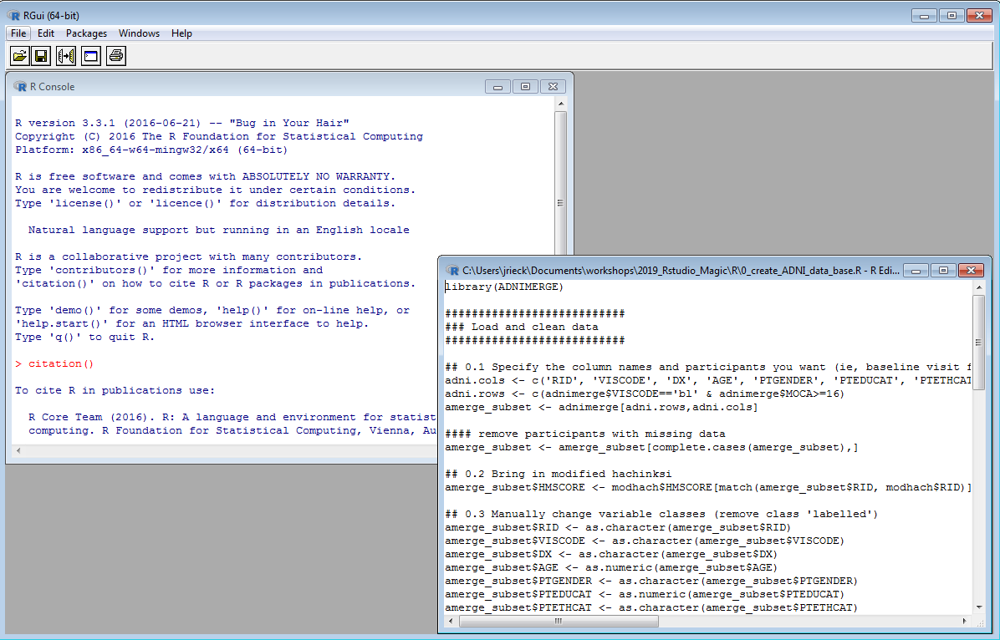
    
## But R has many interfaces

* Today we focus on RStudio (MatLab-like)
* But see also Deducer, RCommander (SPSS-like)
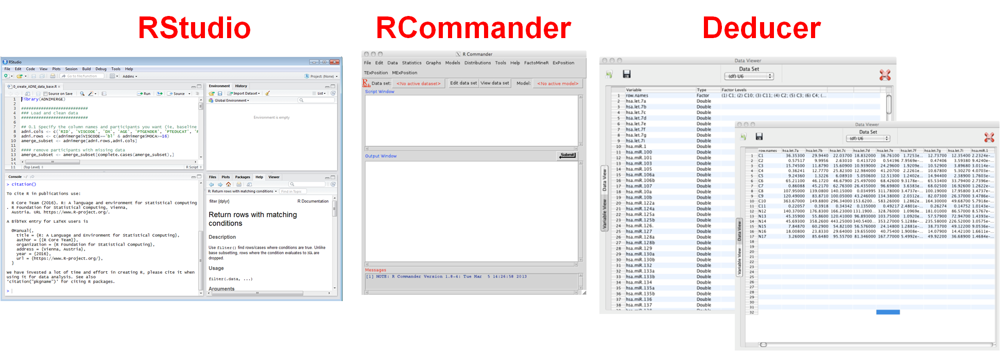

## R is a community (actually many communities!)

* Help and resources
* Package development and distribution

## R: Help!

* [https://www.statmethods.net/](https://www.statmethods.net/)
* Online forums (Stack Exchange, r-lists)
* SpringerLink
    * All R books for free (pdf format) or for minimal cost (printed)
* Vignettes
    * step-by-step instruction guides for packages


## R Packages

* Packages are bundles of code made by someone (or many people) for everyone to use
    * If you can think of a stats problem, there is a package for it
* Available primarily on CRAN
    * But also github, r-forge

## Tidyverse
* something here about tidy

## Part 1: RStudio

* Settings, a quit tour through stuff, features
* Examples on getting setup

## RStudio Environment
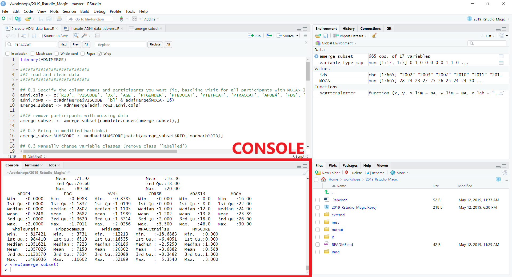

## RStudio Environment 
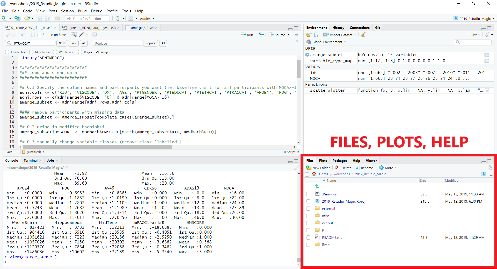

## RStudio Environment 
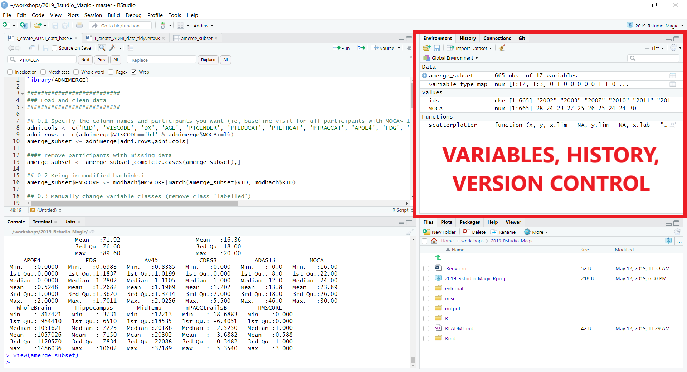

## RStudio Environment 
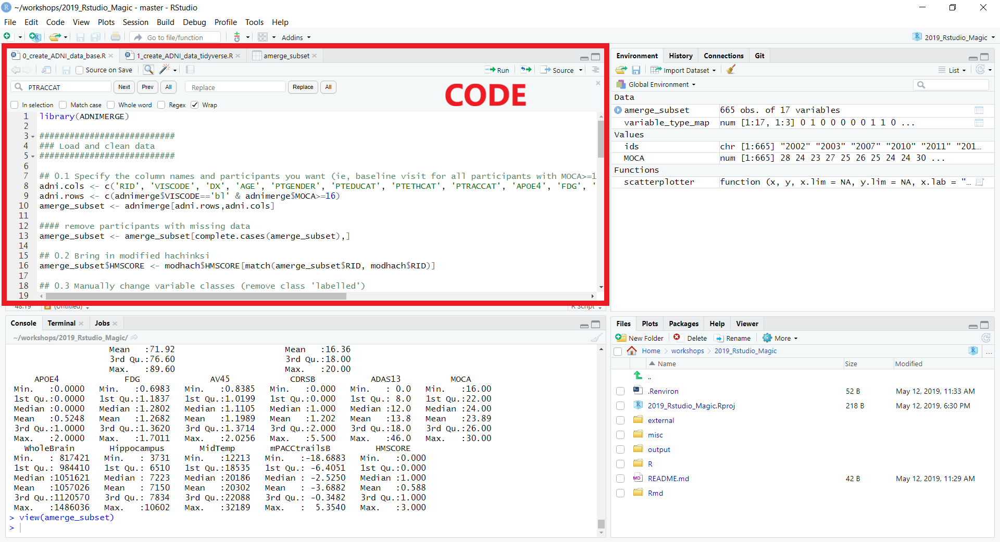

## RStudio Environment 
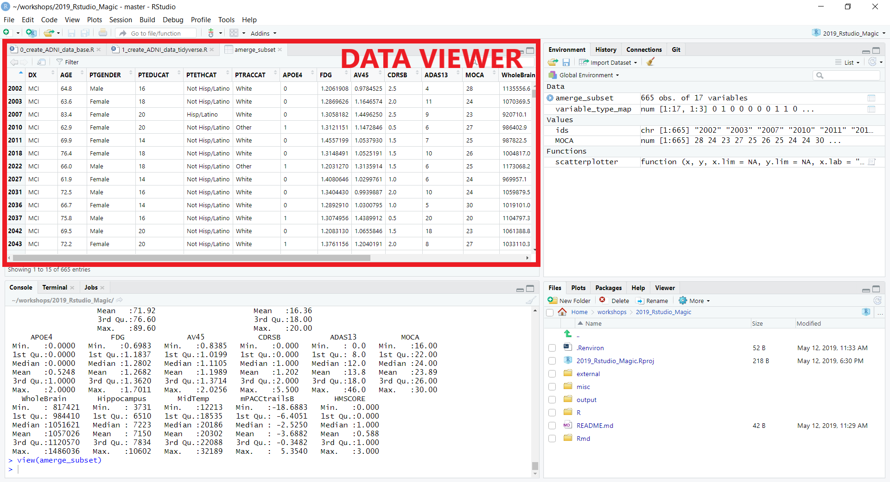

## Benefits of RStudio

* Built-in integration with version control (git or SVN)
* Package and documentation generation
* Reproducible science!
    * R Markdown documents
        * Save and execute code
        * Generate high quality reports that can be shared
    * Create presentations (like this one!)
    * Even write papers

## RStudio Resources
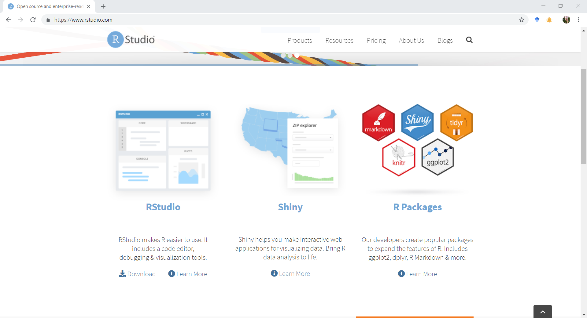

## RStudio Resources
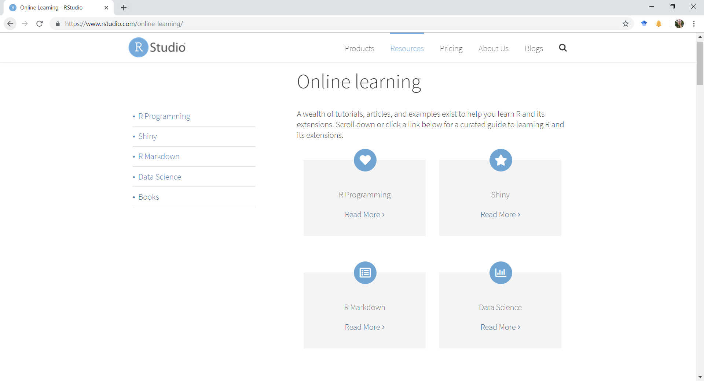

## RStudio Resources
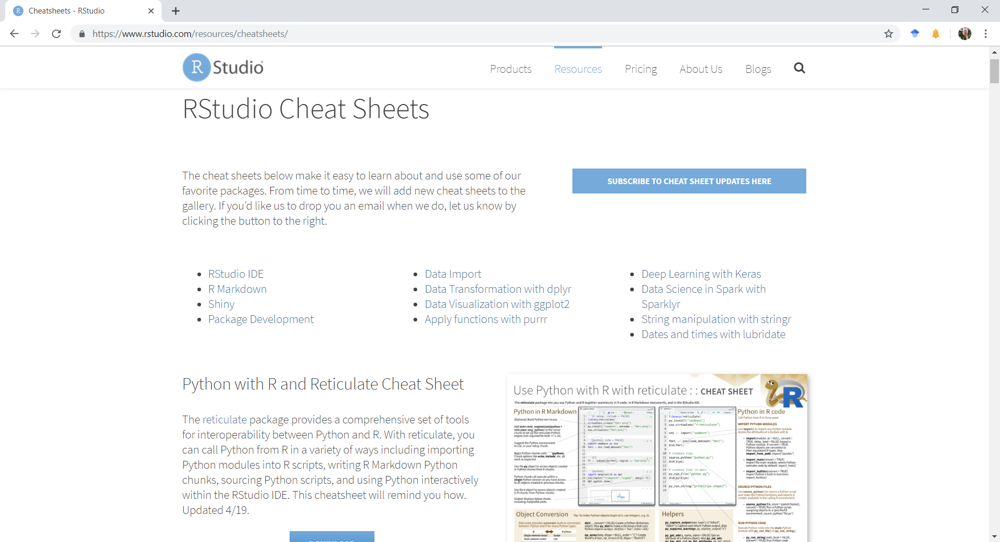

## Part 2: Project and Environment Setup

* Hidden files & whatnot
* Have a structure ready to go on Github
* Explain/walk through
* Discuss the helpful packages above


## RStudio Setup

* Download R and Rstudio
* Add-on packages

```{r install_packages, echo=T, eval=F}
#to install from CRAN
install.pacakges('devtools', depenedencies = TRUE)
#to install from a file
install.packages('/mypath/to/package/ADNIMERGE.tar.gz', 
                 type='source', repos=NULL) 
#to install from a git  (requires the devtools package)
dev.tools::install_github(Gibbsdavidl/CatterPlots) 
```
* See [https://jennybc.github.io/2014-05-12-ubc/ r-setup](https://jennybc.github.io/2014-05-12-ubc/r-setup.html) for a detailed guide

## Rstudio Setup: Projects & Git

* Download git and link to RStudio 
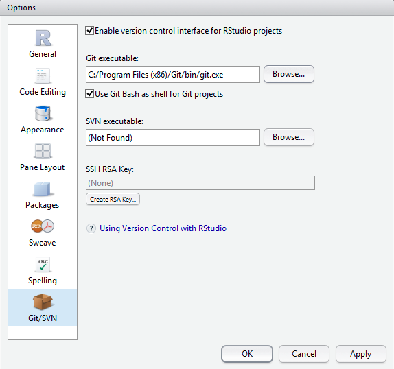

## Rstudio Setup: Projects & Git

* Create a new project File


## Format .gitignore

* File types to ignore:
    * `.Rproj.user`
    * `.Rhistory`
    * `.Ruserdata`
    * `.Renviron`
    * `.rda` & `.Rdata` (to avoid pushing potentially sensitive data files to git)
    * `**` before each extentions will match directories anywhere in the repo
    
## Format environmental variables

* Set environmental variables (ie, directory location of data) to make code generalizable across computers
    * In your project folder create a `.Renviron` file and define variables

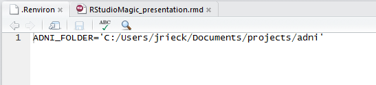
    

